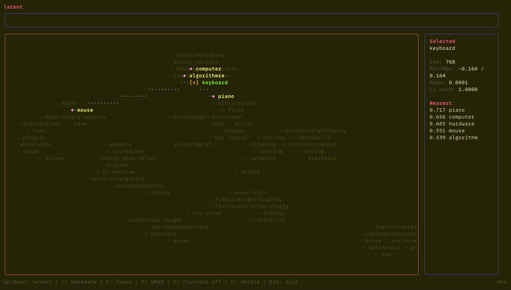

# latent

[](https://go.dev/)
[](https://github.com/alDuncanson/latent/actions/workflows/build.yml)
[](https://github.com/alDuncanson/latent/actions/workflows/release.yml)
[](https://goreportcard.com/report/github.com/alDuncanson/latent)
[](https://github.com/alDuncanson/latent/blob/main/LICENSE)

Peer into latent space.



A terminal UI for visualizing high-dimensional embedding vectors through
dimensionality reduction. Latent explores the structure of vector embeddings by
projecting them from their native high-dimensional space onto a two-dimensional
manifold, revealing clusters and relationships that emerge from semantic
similarity.

Supports multiple projection methods including principal component analysis
(PCA) via singular value decomposition for fast linear projections, and UMAP
(Uniform Manifold Approximation and Projection) for nonlinear dimensionality
reduction that better preserves local and global topological structure.

Currently supports text embeddings via [Ollama](https://ollama.ai)'s
`nomic-embed-text` model, with vectors persisted to a local
[Qdrant](https://qdrant.tech) vector database. Nearest neighbors surface in a
metadata panel for interactive exploration.

## Prerequisites

- Ollama serving `nomic-embed-text` on `localhost:11434`
- Qdrant running on `localhost:6334` (gRPC)

## Install

```bash
curl -sSL https://raw.githubusercontent.com/alDuncanson/latent/main/install.sh | bash
```

or

```bash
go install github.com/alDuncanson/latent@latest
```

## Usage

```bash
latent
```
